# Fadenelemente des Prototyps (Stand 7. September 2026, Runde 13)

107 Elemente, jedes einmal aus dem Prototyp fotografiert (1600 × 1000, mobil 390 × 800). Bilder liegen in `docs/konzept-visuals/elemente/`, die Galerie in `elemente/index.html`.

## A · Startseite und Kopf

**01 · Landing**  
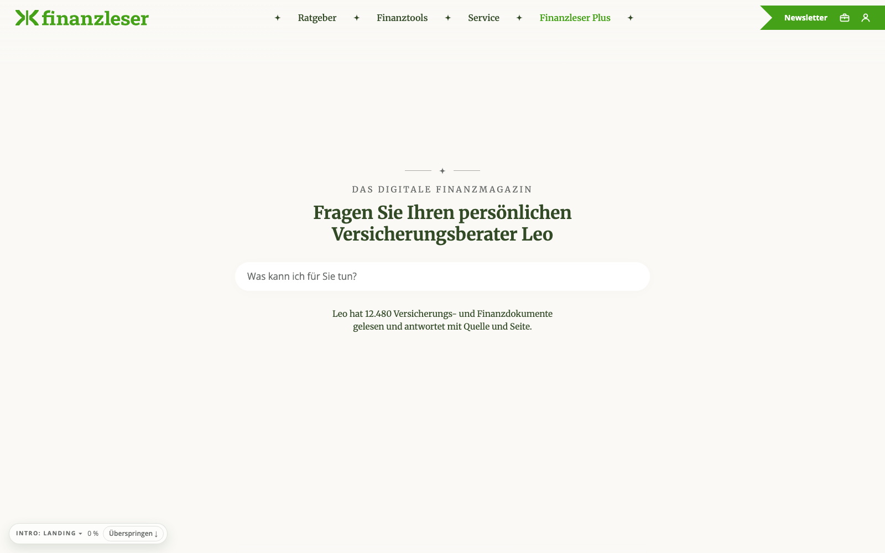  
Wo: Start ohne Parameter, `?intro=landing` · Code: 03c-hero `heroBauer.landing`, CSS `.hero-mitte--landing` · Pille exakt auf 50 vh, 750 px

**02 · Register mit Pille (Hover)**  
  
Wo: Maus über einen Registereintrag · Code: 03-js-core Register-Block (`pilleZu`, `lege`), CSS `.nav-pille`, `.nav-linie` · Port von useNavPill: Lupe 1,1×, zwei Linien

**03 · Lesezeichen**  
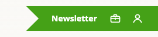  
Wo: Kopf rechts · Code: 02-body `.lesezeichen`, CSS `.lz-*` · Newsletter · Aktenkoffer mit Zahl · Login

**04 · Suchfeld, Hover (Outline zeichnet sich)**  
  
Wo: Maus über die Pille · Code: 03-js-core `feldUmriss`, CSS `.suchpille`, `.feld-umriss` · Port von FieldOutline

**05 · Suchfeld, Fokus mit Text**  
  
Wo: Klick in die Pille, tippen · Code: CSS `.suchpille-wrap:focus-within`, `.senden` · Knopf „Fragen“ erscheint bei Fokus/Text

**06 · Intro „Die Zeitung“ (Alternative)**  
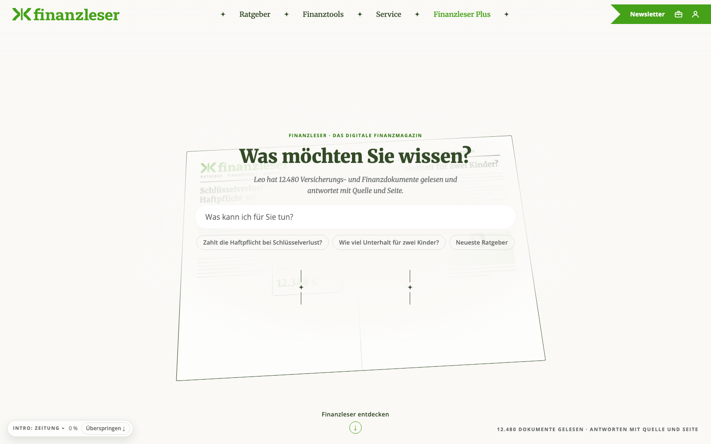  
Wo: `?intro=zeitung` · Code: 03c-hero `heroBauer.zeitung`, CSS `.zt-*` · bleibt als Fassung mit Bewegung wählbar

**07 · Registerblatt Ratgeber**  
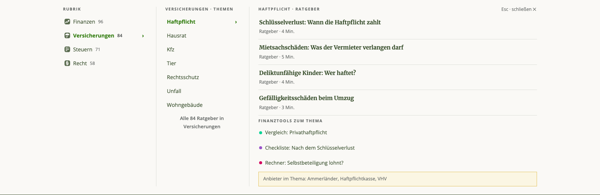  
Wo: Klick auf „Ratgeber“ · Code: 03-js-core `blatt("ratgeber")`, CSS `.blatt`

**08 · Registerblatt Finanztools**  
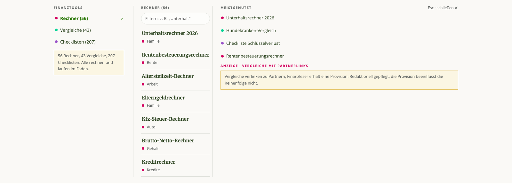  
Wo: Klick auf „Finanztools“ · Code: 03-js-core `blatt("finanztools")`

**09 · Registerblatt Service**  
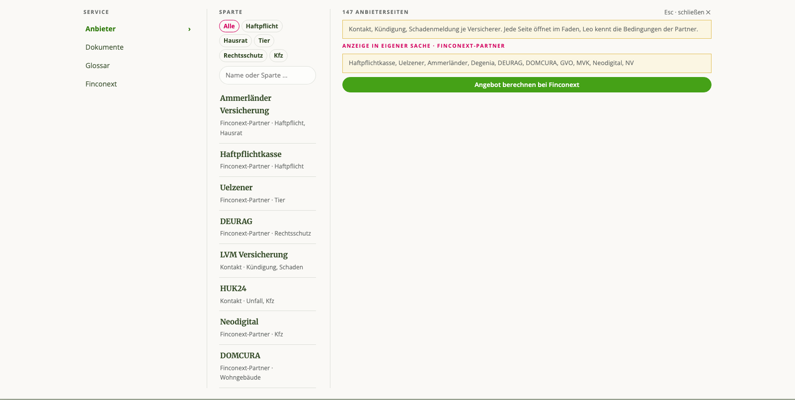  
Wo: Klick auf „Service“ · Code: 03-js-core `blatt("service")`, Daten `SERVICE` in 04 · Anbieter als Liste; die Anbieter-Karte gibt es jetzt im Faden

**10 · Plus-Blatt „Mein Bereich“ (angemeldet)**  
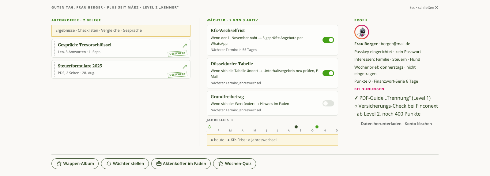  
Wo: `?plus=1`, Klick auf das Personenzeichen · Code: 03-js-core `plusBlatt`, `REGELN`; 05 hängt Wege zu Wappen, Wächter, Koffer, Quiz an

## B · Faden-Grundelemente

**11 · Meldung: Wächter meldet**  
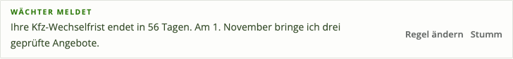  
Wo: `?plus=1` in der Begrüßung · Code: 04 `begruessung` → `meldung()`

**12 · Kapitelkopf**  
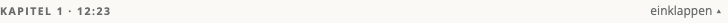  
Wo: jedes Kapitel · Code: 03-js-core `neuesKapitel`, CSS `.kapitel__kopf` · Kicker mit Pfad und Uhrzeit, einklappen

**13 · Leo-Nachricht (Begrüßung)**  
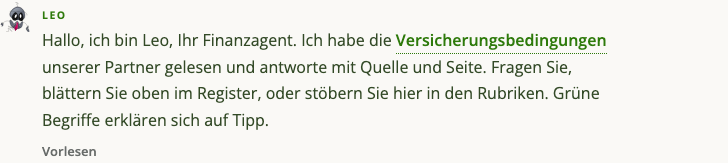  
Wo: Kapitel „Heute“ · Code: 03-js-core `leoNachricht`, CSS `.wort--leo` · Tipp-Animation, Vorlesen

**14 · Meldung: Finanzwort des Tages**  
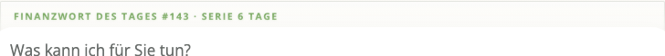  
Wo: Kapitel „Heute“ · Code: 04 `begruessung` → `meldung()`

**15 · Die Spalten (Rubrikenwahl)**  
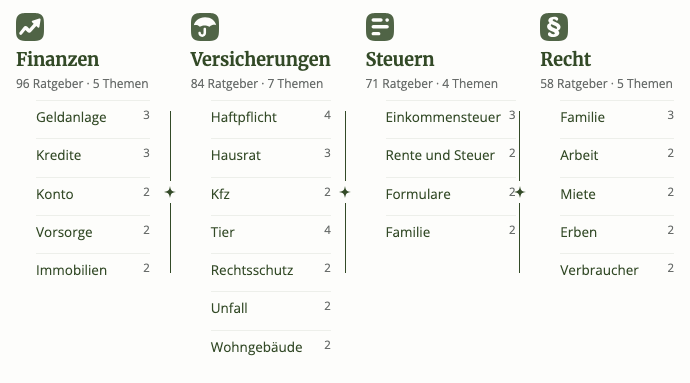  
Wo: Kapitel „Heute“ · Code: 03-js-core `spaltenwahl`, CSS `.spalten` · Hover-Box aus den Linien

**16 · Leo-Zeile mit Vorschlägen**  
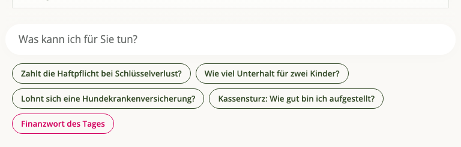  
Wo: am Ende des Fadens · Code: 02-body `#fadenPille`, 03-js-core `chipsPruefen`, 04 `folgeChips` · Vorschläge nur am Fadenende, absolut, nach jedem Schritt passend

**17 · Sprungleiste (Suche im Bestand)**  
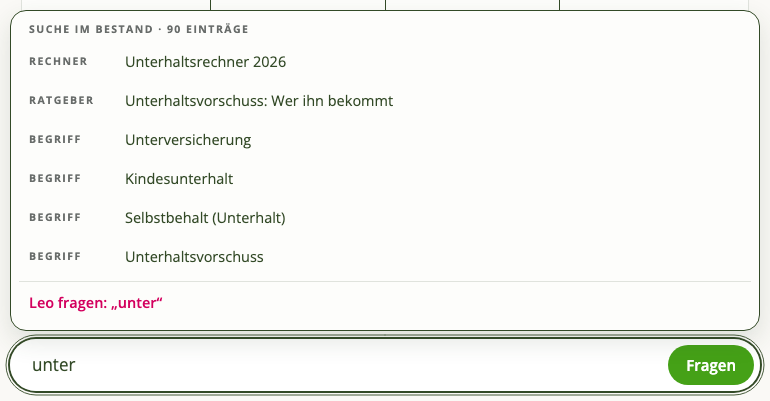  
Wo: in die Zeile tippen · Code: 04 `sprungSuche`, `INDEX`, CSS `.sprung`

**18 · Spalte aufgeklappt**  
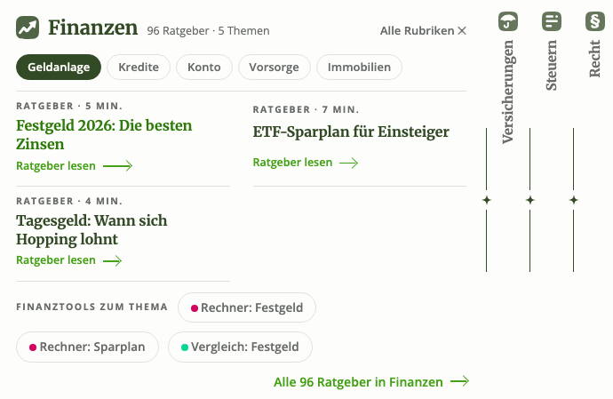  
Wo: Thema in einer Spalte antippen · Code: 03-js-core `spaltenwahl` (`oeffne`) · andere Rubriken als Rücken

**19 · Ihre Frage**  
  
Wo: jede gestellte Frage · Code: 03-js-core `userNachricht` (05 mit Flug), CSS `.wort--frage`

**20 · Leo-Antwort mit Quellen**  
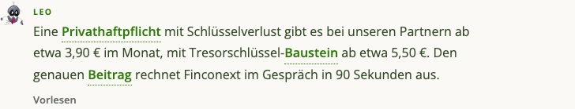  
Wo: z. B. „Was kostet so ein Tarif?“ · Code: 03-js-core `leoNachricht` mit `quellen`

**21 · Einwurf „Leo wirft ein“**  
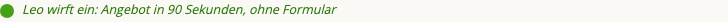  
Wo: vor Kästen mit `grund` · Code: 03-js-core `kasten()` → `.einwurf`

**22 · Finconext-Karte (Anzeige in eigener Sache)**  
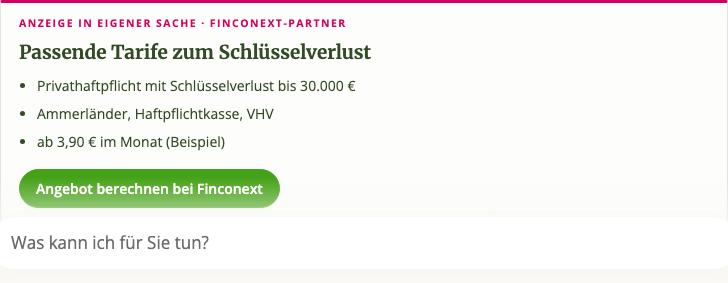  
Wo: nach „Was kostet so ein Tarif?“ · Code: 04 `kaesten.anbieterSchluessel` · Abstände neu; Knopf führt zur Übergabe

**23 · Vorschläge im Strom**  
  
Wo: nach Leo-Antworten · Code: 03-js-core `chips()` · verschwinden beim Klick

**24 · Toast**  
  
Wo: Aktenkoffer, Kopieren, Demo-Hinweise · Code: 03-js-core `toast`

**46 · Rücksprung „Zurück zu …“**  
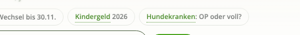  
Wo: nach einem Sprung ans Fadenende · Code: 03-js-core `lesestelleMerken`

**47 · Leo-Kurzfassung eines Ratgebers**  
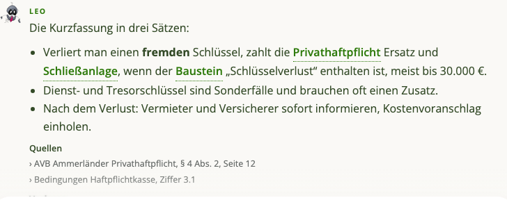  
Wo: „Kurzfassung von Leo“ · Code: 04 `kurzfassung-schluesselverlust`, `ARTIKEL.leoKurz`

**69 · Fußnote**  
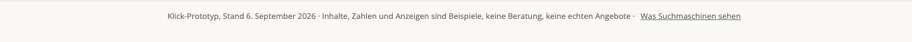  
Wo: Seitenende · Code: 02-body `.fussnote` · Prototyp-Hinweis, Kulissen-Link

**98 · Leerzustand: Leo weiß es nicht**  
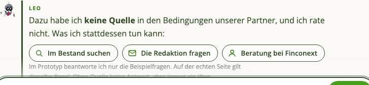  
Wo: jede unbekannte Frage · Code: 05 `szenarien.frei` · drei Wege statt Raten: Bestand, Redaktion, Finconext

**99 · Übergabe an Finconext**  
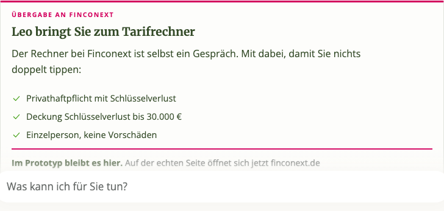  
Wo: „Angebot berechnen bei Finconext“ · Code: 05 `uebergabe` · Papierflieger fliegt zum Rand, Linie füllt sich, Angaben reisen mit

**100 · Ladezustand (Skelett)**  
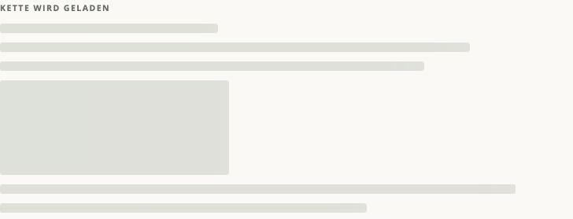  
Wo: beim Laden einer Kette · Code: 05 `skelett`, `ladeDann` · schimmert, 0,55 s

**101 · Leerzustand: offline**  
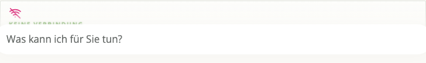  
Wo: `?offline=1`, Browser offline · Code: 05 `offlineMeldung`

**103 · Mikroanimation: Aktenkoffer-Flug**  
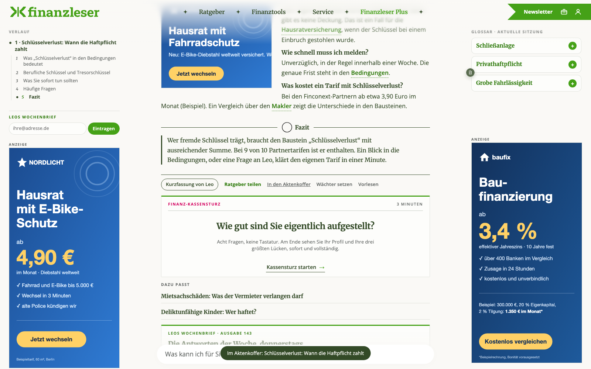  
Wo: „In den Aktenkoffer“ · Code: 05 `kofferFlug`, `flugZu` · Eintrag fliegt in Bogen zum Koffer im Lesezeichen

**104 · Mikroanimation: Koffer blinkt, Zahl springt**  
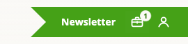  
Wo: nach dem Flug · Code: CSS `.lz-icon.blinkt`, `.lz-zahl.popt`

**105 · Mikroanimation: Frage steigt auf**  
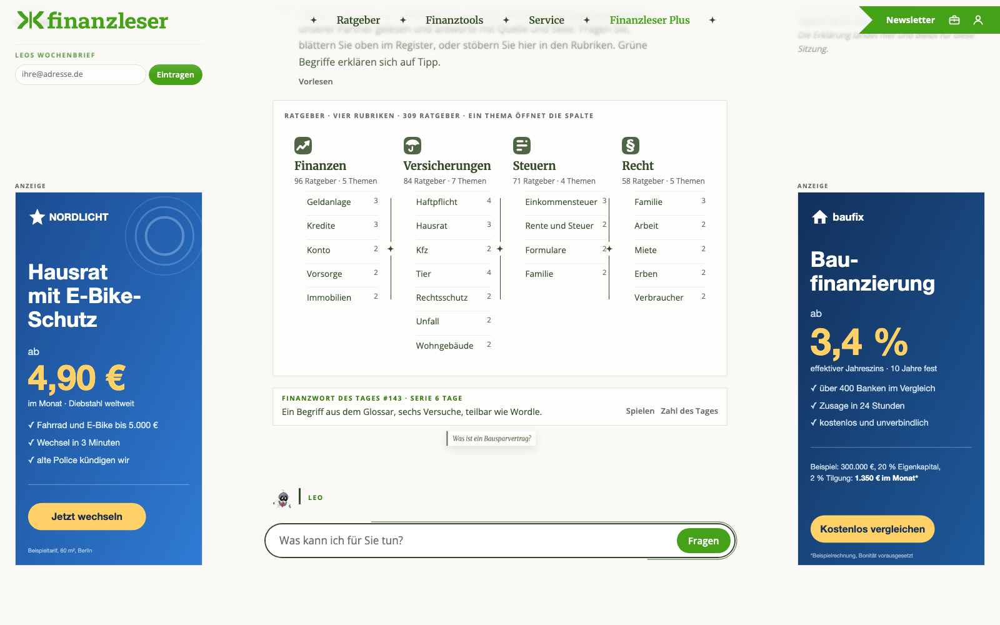  
Wo: Frage absenden · Code: 05 `userNachricht`-Wrapper, `flugZu` · Text fliegt aus der Zeile an seine Stelle im Faden

**106 · Teilen-Dialog**  
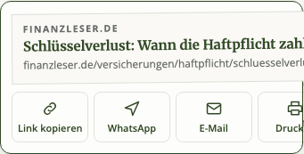  
Wo: „Ratgeber teilen“, „Ergebnis teilen“ · Code: 05 `teilenDialog` · Zeitungsausriss, Link · WhatsApp · E-Mail · Drucken

**107 · Teilen-Dialog: Stempel „Kopiert“**  
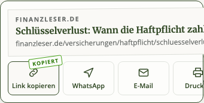  
Wo: „Link kopieren“ · Code: CSS `.gestempelt`

## C · Ratgeber-Kette

**25 · Glossar-Klickmenü**  
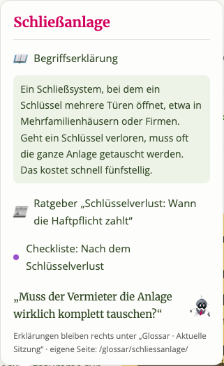  
Wo: grünen Begriff antippen · Code: 03-js-core `begriffMenue`, CSS `.bmenu` · Erklärung · Ratgeber · Tool · Frage an Leo; Begriff fliegt in die Randspalte

**26 · Leo fragt (Randspalte)**  
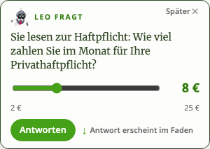  
Wo: nach einer Weile im Ratgeber, `?frage=haftpflicht` · Code: 03-js-core `LEO_FRAGEN`, `leoFrageZeigen`; Auslöser 04 `FRAGE_NACH` · poppt auf, „Später“, Antwort im Faden

**27 · Anzeige 728 × 90 vor dem ersten Kapitel**  
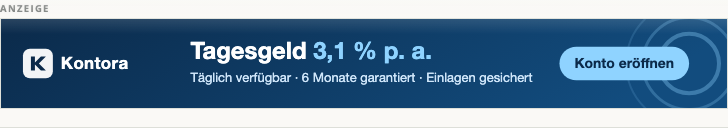  
Wo: Beginn des Stroms · Code: 03-js-core `neuesKapitel` → `einschub--top`

**28 · Ratgeber-Kopf**  
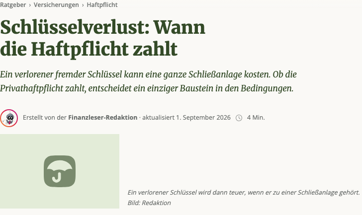  
Wo: Kette, oben · Code: 04 `kette()`: Krumen, Titel, Vorspann, Autor, Bild · davor kurz das Skelett

**29 · Inhaltsverzeichnis im Ratgeber**  
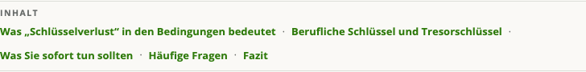  
Wo: unter dem Bild · Code: 04 `kette()` `.inhalt` · Sprung zum Abschnitt

**30 · Abschnitt mit umflossener Anzeige und Torte**  
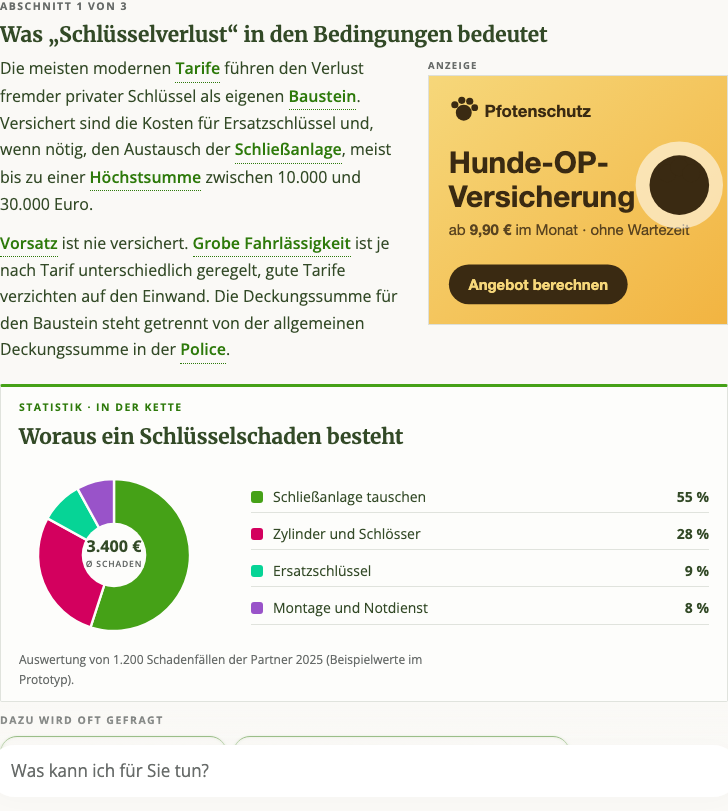  
Wo: Abschnitt 1 · Code: 04 `kette()`, `.fliess`, CSS `.einschub--umflossen`

**31 · Anzeige 300 × 250, umflossen**  
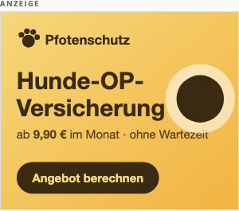  
Wo: Abschnitt 1 rechts, FAQ links · Code: CSS `.einschub--umflossen`

**32 · Weiterlesen mit Leo: Fragen**  
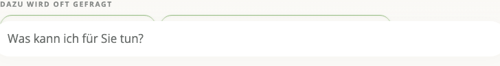  
Wo: Ende jedes Abschnitts · Code: 04 `weiterlesen(ab)`, Daten `abschnitte[i].fragen` · Idee 4

**33 · Weiterlesen: Antwort im Abschnitt + WhatsApp**  
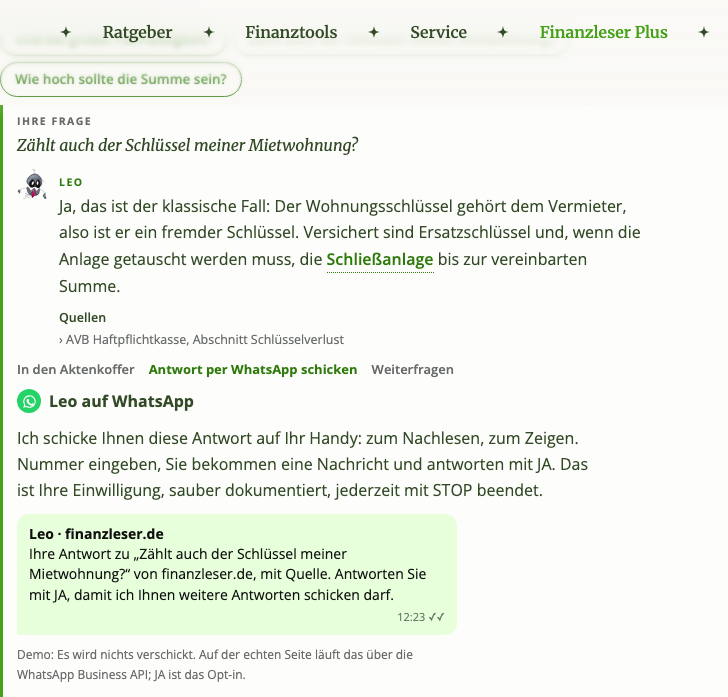  
Wo: Frage antippen, dann „per WhatsApp schicken“ · Code: 04 `inlineAntwort`, 03-js-core `leoInline`, `whatsappKarte`

**34 · Statistik (Balken)**  
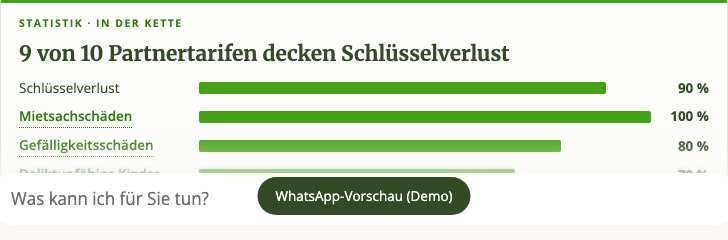  
Wo: Abschnitt 2 · Code: 04 `kaesten.statistikSchluessel`, `balken()` · animiert beim Einblenden

**35 · Anzeige 728 × 90 im Ratgeber**  
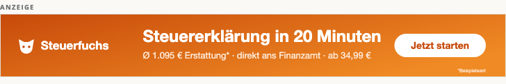  
Wo: nach Abschnitt 2 · Code: 04 `kette()` `einschub--artikel`

**36 · Checkliste**  
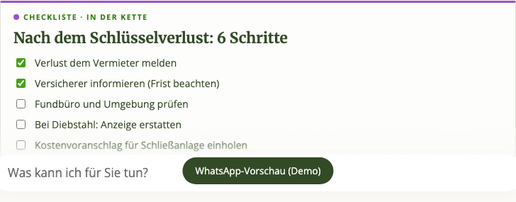  
Wo: Abschnitt 3 und Kapitel `checkliste` · Code: 04 `kaesten.checklisteSchluessel` · Fortschritt im Aktenkoffer

**37 · Häufige Fragen**  
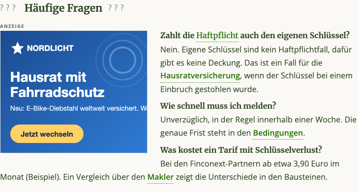  
Wo: Kette · Code: 04 `kette()`, CSS `.faq-kopf`, `dl.faq` · mit umflossener Anzeige links

**38 · Fazit**  
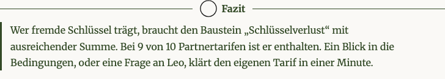  
Wo: Kette · Code: 04 `kette()`, CSS `.fazit-kopf`, `.fazit`

**39 · Aktionen unter dem Ratgeber**  
  
Wo: Kette · Code: 04 `kette()` `.aktionen` · Kurzfassung · Teilen (Dialog) · Aktenkoffer (Flug) · Wächter · Vorlesen

**40 · Kassensturz-Teaser**  
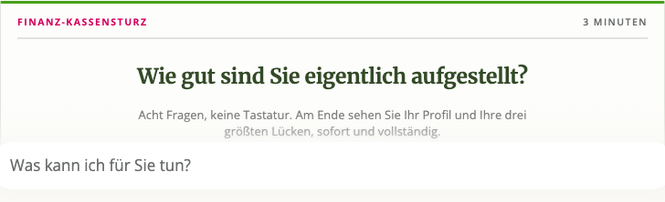  
Wo: Ende des Ratgebers · Code: 04 `kassensturzTeaser`

**41 · Dazu passt**  
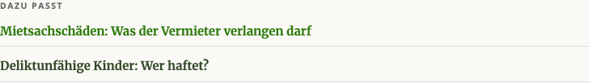  
Wo: Ende des Ratgebers · Code: 04 `kette()` `.dazu` · Ziele sind Platzhalter

**42 · Wochenbrief-Kasten**  
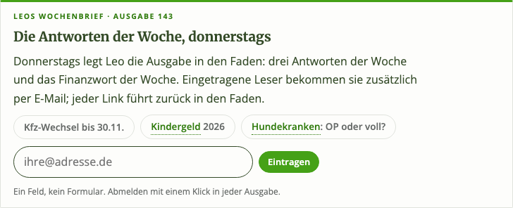  
Wo: Ende des Ratgebers, Kapitel `wochenbrief` · Code: 04 `kaesten.wochenbrief`, `wochenbriefKarte` · ein Feld, kein Formular

**43 · Randspalte links: Verlauf mit Inhaltsverzeichnis**  
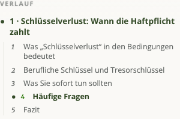  
Wo: links · Code: 03-js-core `listeAktualisieren`, `tocSetzen`, CSS `.verlauf` · klebt oben, scrollt in sich ab 38 vh; neuer Eintrag blendet ein

**44 · Randspalte rechts: Glossar der Sitzung**  
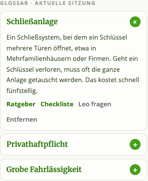  
Wo: rechts · Code: 03-js-core `inSitzung`, CSS `.glossar-rail` · vorbelegt je Inhalt, neuer Begriff leuchtet kurz

**45 · Randspalte: Anzeige 300 × 600**  
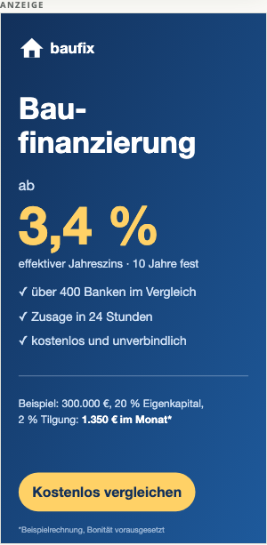  
Wo: unten in beiden Randspalten · Code: 03-js-core `einschubFuellen`, `werbung.py` · wird erst am Fadenende hochgeschoben

**48 · Kulissen: Was Suchmaschinen sehen**  
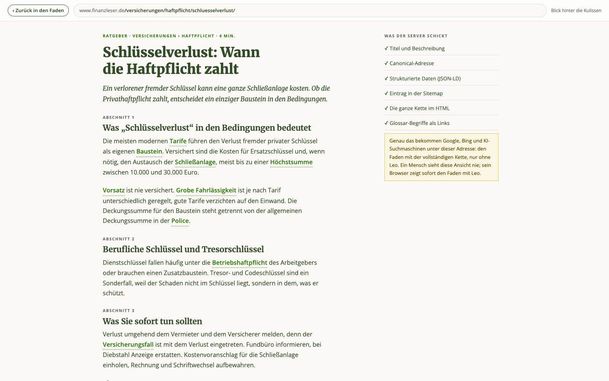  
Wo: Fußnote → „Was Suchmaschinen sehen“ · Code: 04 `kulissen`, 02-body `#seite` · kanonische Seite ohne Leo

**96 · Mikroanimation: Haken streicht durch**  
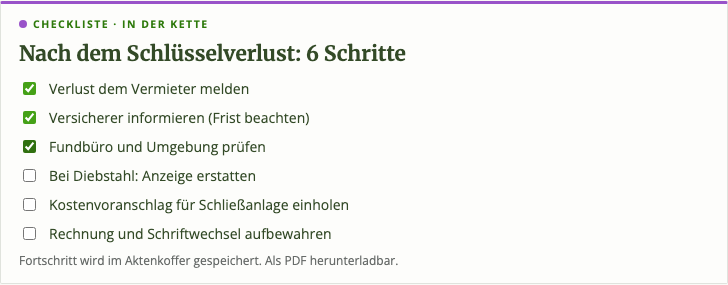  
Wo: Punkt abhaken · Code: CSS `.checkliste input:checked + span` · Linie wächst über den Text

**97 · Statistik: Torte (Kreisdiagramm)**  
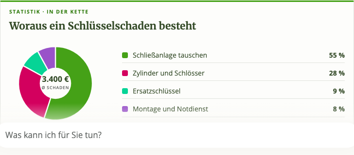  
Wo: Abschnitt 1 · Code: 05 `torte()` · Stil der Liveseite: weiße Fugen, Wert in der Mitte, Legende mit Hover; Stücke wachsen aus der Mitte

## D · Finanztools und Karten

**49 · Rechner: Unterhalt**  
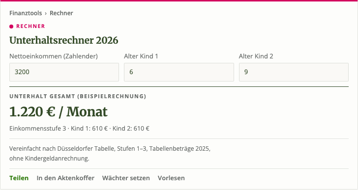  
Wo: `?karte=unterhalt` · Code: 04 `kaesten.rechnerUnterhalt`, `unterhaltsrechner()`

**50 · Spiel: Mythos oder Fakt**  
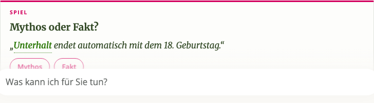  
Wo: nach dem Unterhaltsrechner · Code: 04 `kaesten.spielUnterhalt`, `mythos()`

**51 · Vergleich: Hundekrankenversicherung**  
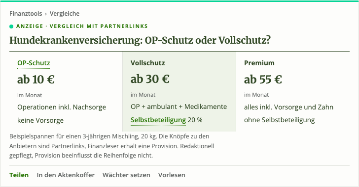  
Wo: `?karte=hund` · Code: 04 `kaesten.vergleichHund` · Kennzeichnung „Anzeige · Vergleich mit Partnerlinks“

**52 · Statistik (Ring)**  
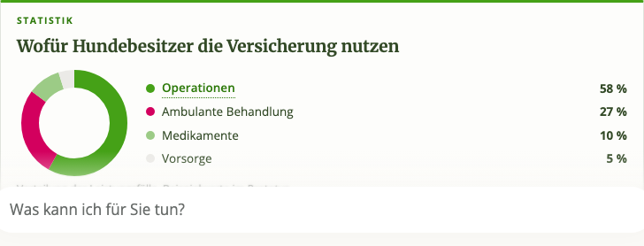  
Wo: nach dem Hundevergleich · Code: 04 `kaesten.ringHund`, `donut()`

**53 · Finconext-Karte (Tier)**  
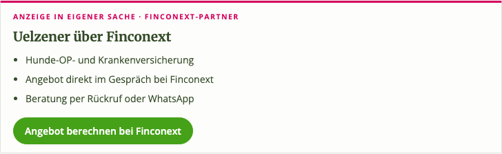  
Wo: nach dem Hundevergleich · Code: 04 `kaesten.anbieterHund` · Knopf führt zur Übergabe

**54 · Dokument: Steuerformulare**  
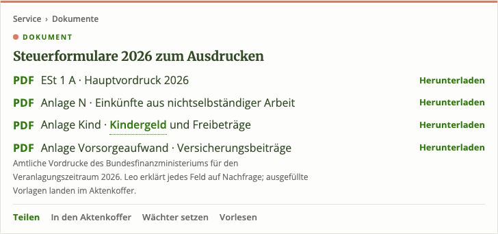  
Wo: `?karte=steuerformulare` · Code: 04 `kaesten.steuerformulare`, `dokumentKarte()`

**55 · Über Finconext**  
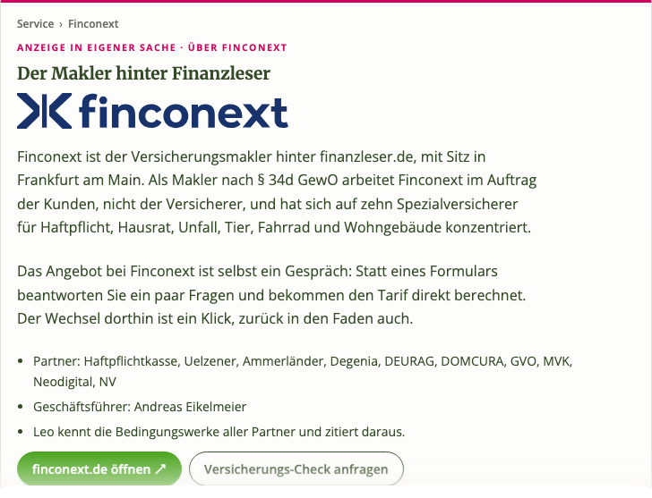  
Wo: `?karte=finconext` · Code: 04 `kaesten.finconext`, `finconextKarte()`

**56 · Spiel: Finanzwort des Tages**  
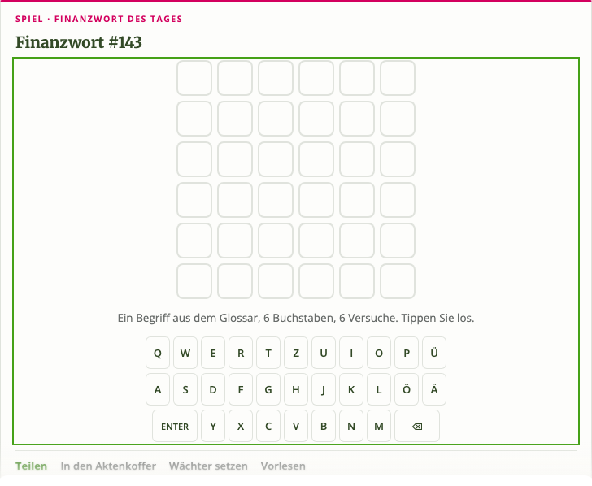  
Wo: `?karte=wortspiel` · Code: 04 `wortspiel()`, Belohnung `belohne` · Wordle-Mechanik, Konfetti

**57 · Spiel: Zahl des Tages (Schätzfrage)**  
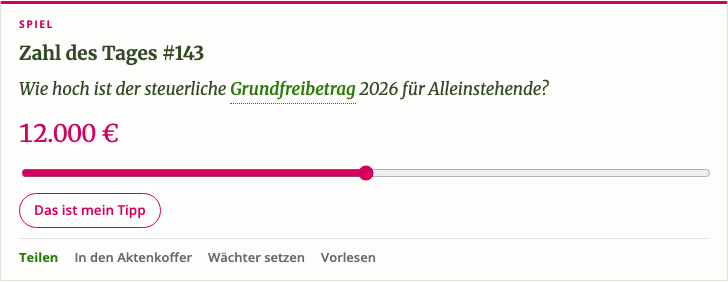  
Wo: `?karte=tagesfrage` · Code: 04 `schaetzfrage()`

**58 · Glossar-Nachschlagewerk**  
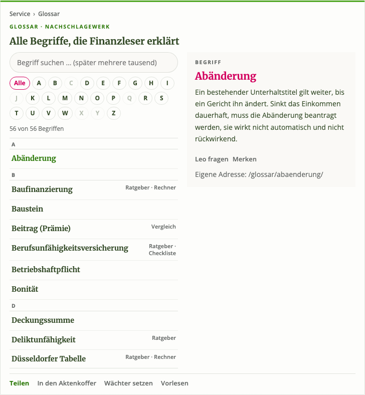  
Wo: `?karte=glossar` · Code: 04 `glossarNachschlag()` · Suche, Alphabet, Detail

**59 · Kassensturz: Frage als Karten mit Ikonen**  
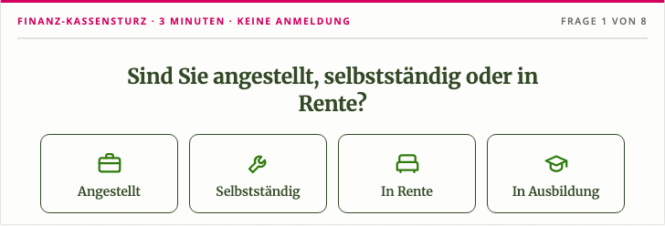  
Wo: `?karte=kassensturz` · Code: 04 `kassensturzKasten`, `KS_FRAGEN`, `KS_IKON`; Ikonen 05 `IKON` · gewählte Karte füllt sich dunkel, Bühne wechselt ruhig

**60 · Kassensturz: Mehrfachwahl**  
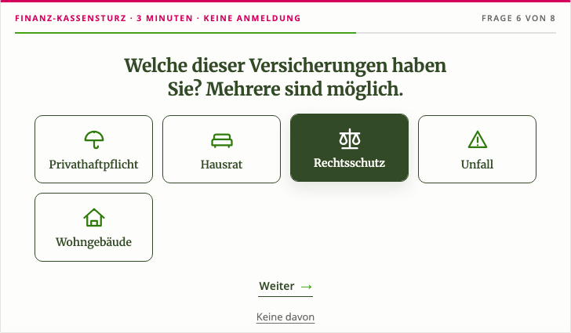  
Wo: Frage 6 · Code: 04 `kassensturzKasten` (`mehrfach`)

**61 · Kassensturz: Schätzfrage**  
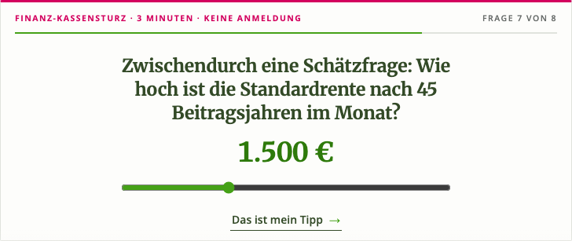  
Wo: Frage 7 · Code: 04 `KS_FRAGEN` (`schaetz`)

**62 · Kassensturz: Ergebnis mit Tacho und Karten**  
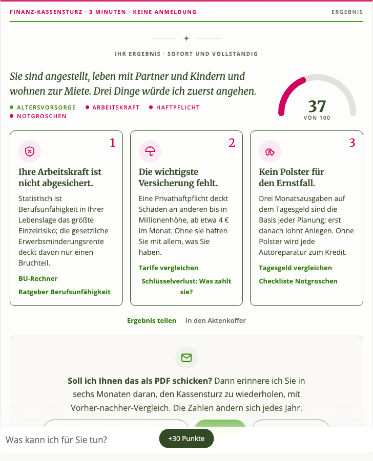  
Wo: nach Frage 8 · Code: 04 `ergebnis()`, 05 `tacho()` · Vorspann, Ampel, Tacho, drei Karten mit Ikonen, großes Feld für die Adresse

**63 · Leo auf WhatsApp**  
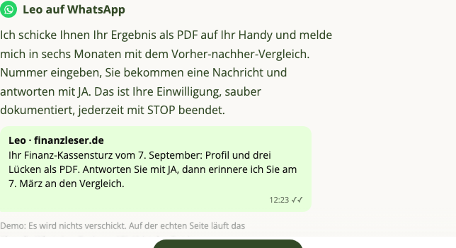  
Wo: Kassensturz, Weiterlesen, Wächter · Code: 03-js-core `whatsappKarte` · JA = Opt-in, Demo-Vorschau

**64 · Wächter (Leo-Antwort mit Vorschlägen)**  
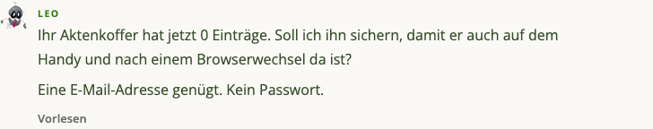  
Wo: „Wächter setzen“ · Code: 04 `waechter` · die Wächter-Karte gibt es jetzt zusätzlich

**65 · Sicherungsfrage (Plus)**  
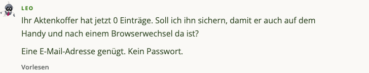  
Wo: nach dem dritten Koffer-Eintrag · Code: 04 `sicherung`

**66 · Beleg aus dem Aktenkoffer**  
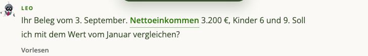  
Wo: Plus-Blatt → Beleg · Code: 04 `beleg`

**67 · Platzhalter-Antwort (Demo-Ratgeber)**  
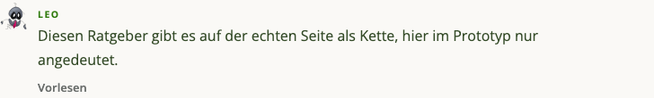  
Wo: alle nicht gebauten Inhalte · Code: 04 `demo-ratgeber`, `demo-tool`, `demo-tabelle` · hier fehlen nur noch Inhalte, keine Elementtypen

**68 · Frage an Leo aus dem Glossar**  
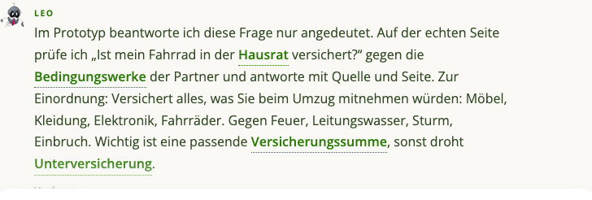  
Wo: Klickmenü → „Frage an Leo“ · Code: 04 `begriff-frage`, `GLOSSAR[key].antwort`

**74 · Anbieter-Karte (LVM)**  
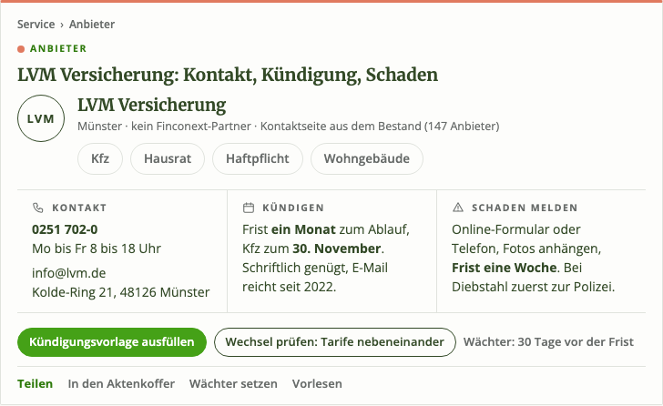  
Wo: `starte("anbieter")`, Sprungleiste „LVM“ · Code: 05 `anbieterKarte`, `kaesten.anbieterLVM` · Kartentyp 6 von 8: Kontakt, Kündigen, Schaden; Wege zu Vorlage, Vergleich, Wächter

**75 · Vergleich als Tabelle (Privathaftpflicht)**  
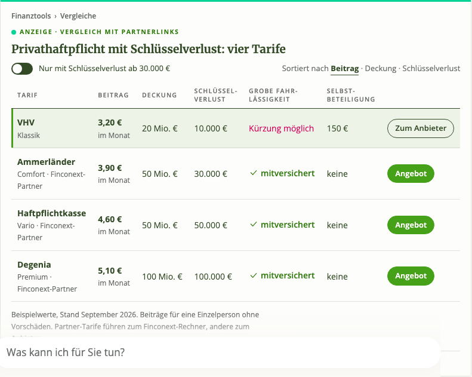  
Wo: `starte("tarife")` · Code: 05 `vergleichTabelle`, `TARIFE` · Filter, Sortierung, Bestwert markiert, Übergabe an Finconext

**76 · Vergleich: gefiltert**  
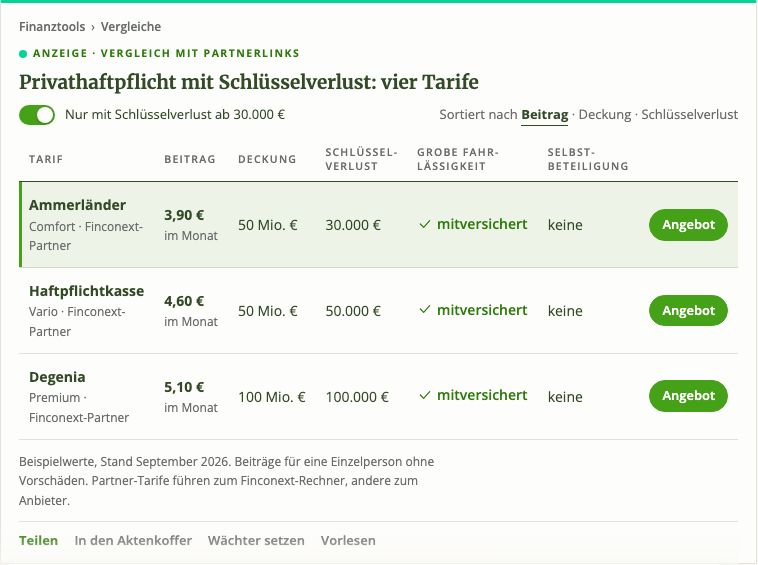  
Wo: Schalter „nur mit Schlüsselverlust“ · Code: 05 `vergleichTabelle`

**77 · BU-Rechner mit interaktiven Säulen**  
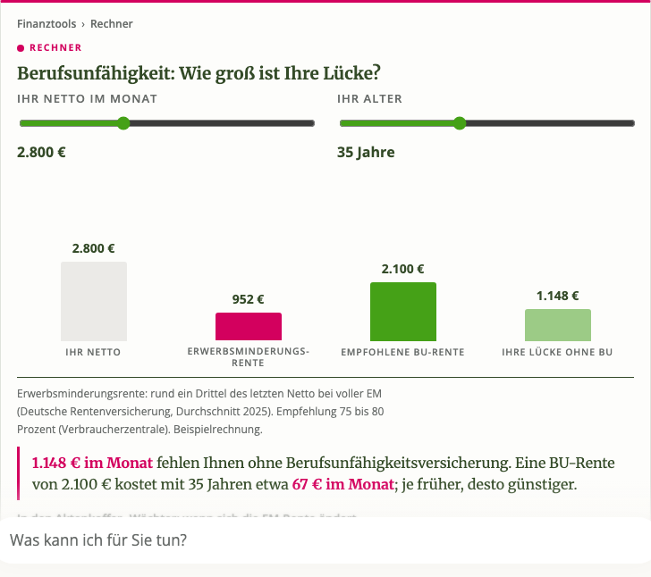  
Wo: `starte("bu")` · Code: 05 `buRechner`, `saeulen()` · die vertikale Statistik läuft mit den Reglern mit

**78 · BU-Rechner nach Änderung**  
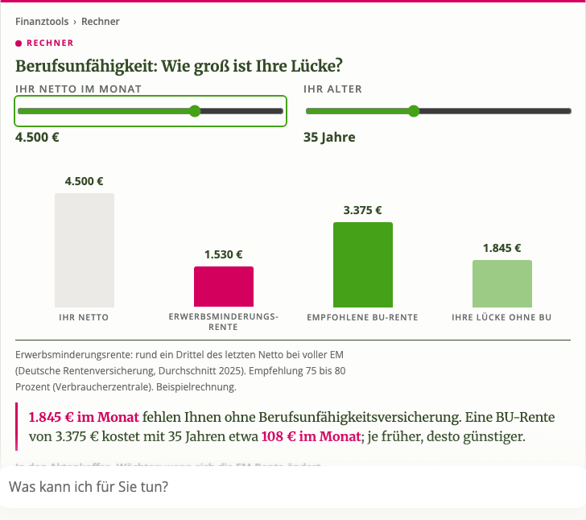  
Wo: Regler Netto auf 4.500 € · Code: 05 `saeulen().setze`

**79 · Dokument-Vorlage: Kündigung Kfz**  
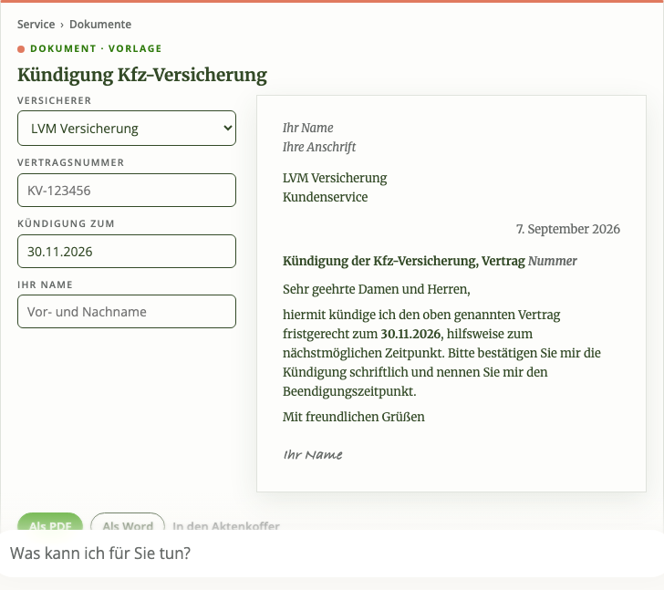  
Wo: `starte("vorlage")` · Code: 05 `vorlage` · der Brief entfaltet sich, Felder schreiben mit

**80 · Dokument-Vorlage, ausgefüllt**  
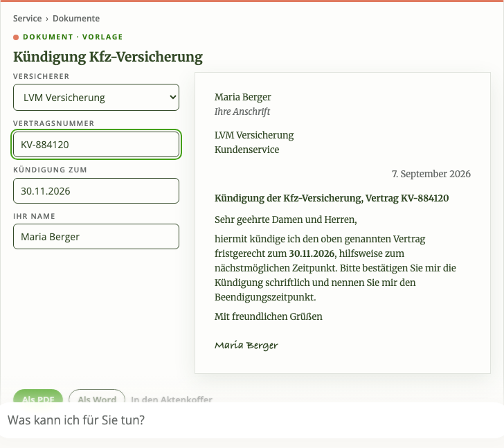  
Wo: Name und Nummer eingetragen · Code: 05 `vorlage`

**81 · Wochen-Quiz: Frage**  
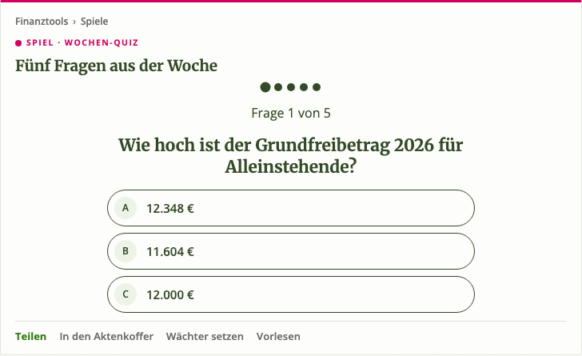  
Wo: `starte("quiz")` · Code: 05 `quizKarte`, `QUIZ` · Punkte-Leiste, Antworten A/B/C

**82 · Wochen-Quiz: Ergebnis**  
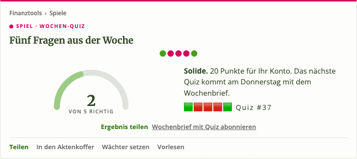  
Wo: nach fünf Fragen · Code: 05 `quizKarte` → `tacho()` · Teilen-Raster, Punkte, Wappen „Sparen“

**83 · Wappen-Album**  
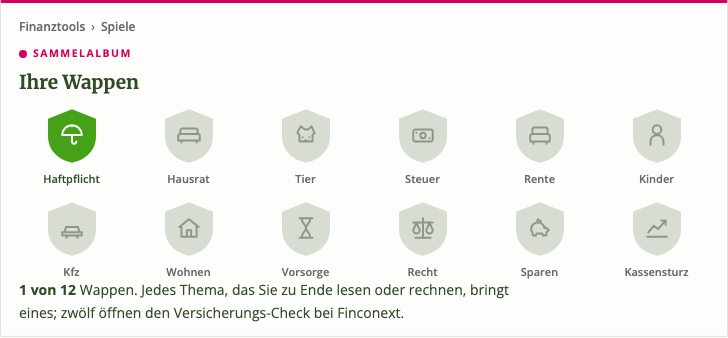  
Wo: `starte("wappen")` · Code: 05 `wappenKarte`, `wappenFrei` · freigeschaltete Wappen klappen auf

**84 · Rubbellos**  
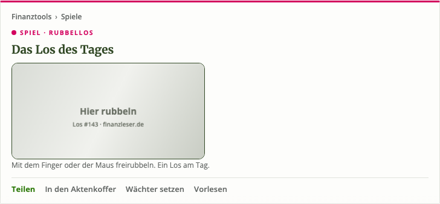  
Wo: `starte("rubbellos")` · Code: 05 `rubbellos` (Canvas)

**85 · Rubbellos, freigerubbelt**  
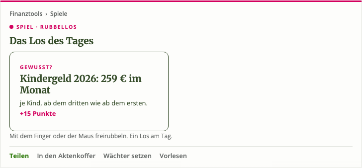  
Wo: mit Maus oder Finger · Code: 05 `rubbellos` · +15 Punkte, Wappen „Kinder“

**86 · Gewusst-Box**  
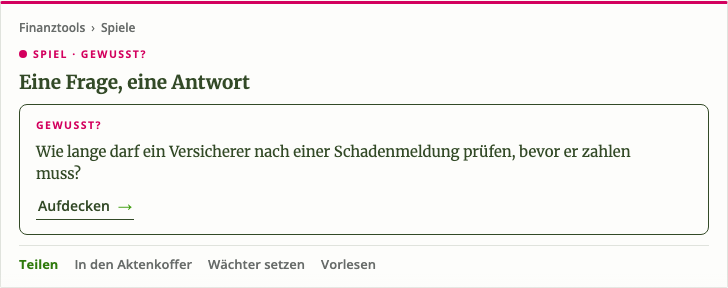  
Wo: `starte("gewusst")`, im Wochenbrief · Code: 05 `gewusstBox` · klappt um

**87 · Gewusst-Box, aufgedeckt**  
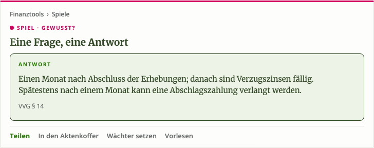  
Wo: „Aufdecken“ · Code: 05 `gewusstBox`

**88 · Wächter-Karte**  
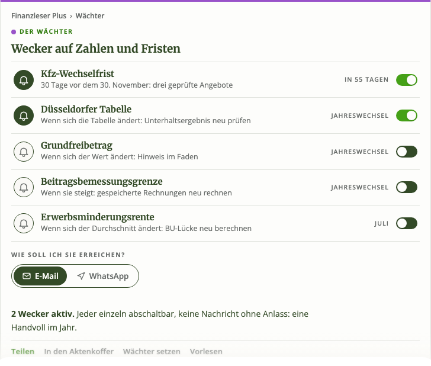  
Wo: `starte("waechterkarte")` · Code: 05 `waechterKarte`, `WAECHTER_REGELN` · Schalter, Glocke läutet beim Einschalten

**89 · Wächter-Karte: Kanal WhatsApp**  
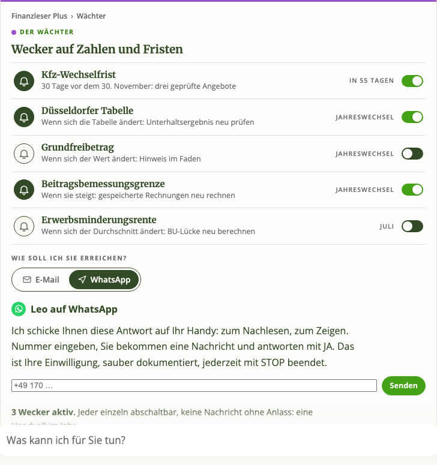  
Wo: Segment „WhatsApp“ · Code: 05 `waechterKarte` → `whatsappKarte`

**90 · Aktenkoffer-Karte**  
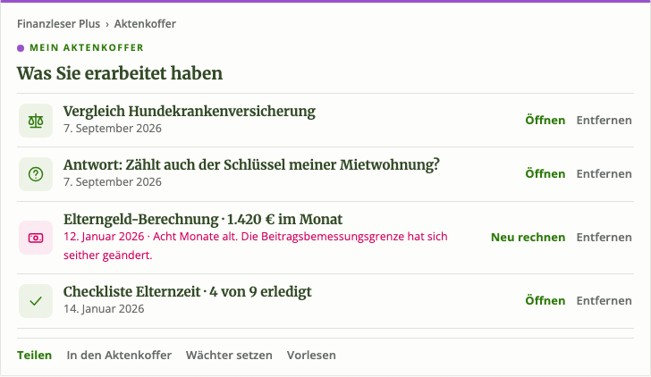  
Wo: `starte("kofferkarte")`, Plus-Blatt · Code: 05 `kofferKarte` · veraltete Einträge in Magenta mit „Neu rechnen“

**91 · Aktenkoffer-Karte, leer**  
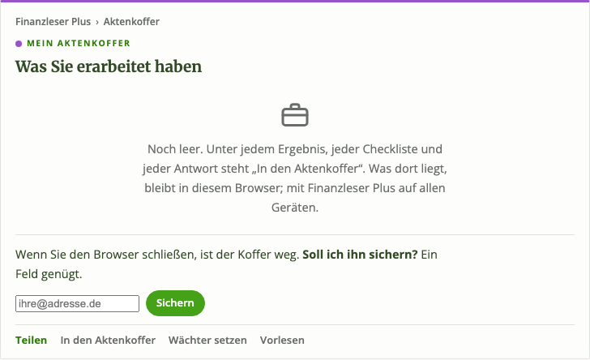  
Wo: ohne Einträge · Code: 05 `kofferKarte` · Leerzustand mit Sicherungsfeld

**92 · Lebensereignis: Ein Kind kommt**  
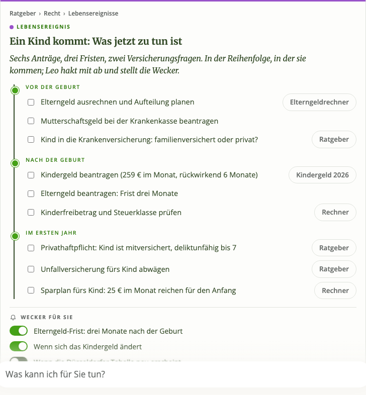  
Wo: `starte("kind")` · Code: 05 `ereignisKarte`, `EREIGNIS_KIND` · Zeitleiste, Werkzeuge je Schritt, Wecker

**93 · Wochenbrief-Ausgabe 143**  
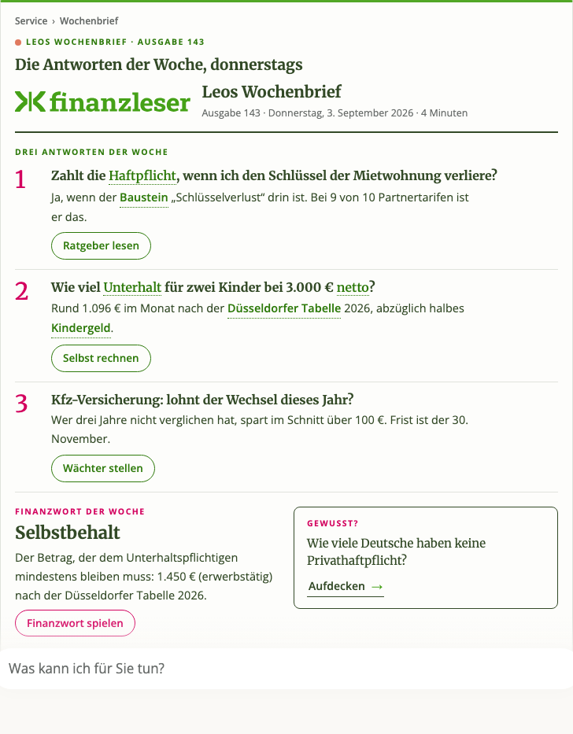  
Wo: `starte("ausgabe")` · Code: 05 `ausgabeKarte` · drei Antworten, Finanzwort, Gewusst, Termine

**94 · Kassensturz: Ergebnis ohne Lücken**  
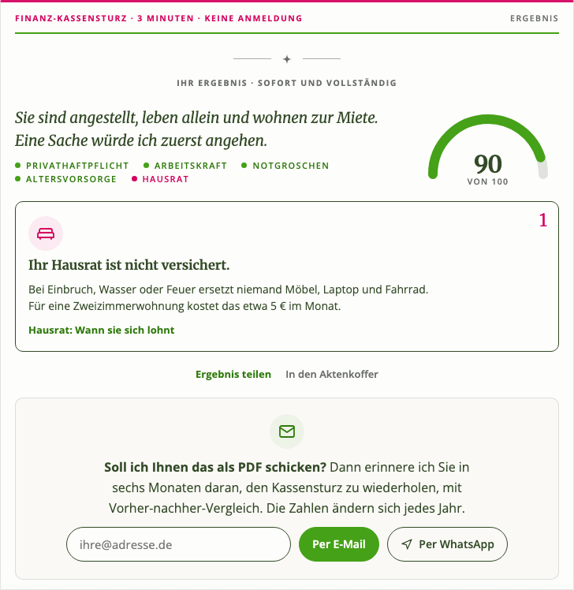  
Wo: alles „Ja“ · Code: 04 `ergebnis()` · Tacho hoch, grüne Karte

**95 · Level-Aufstieg**  
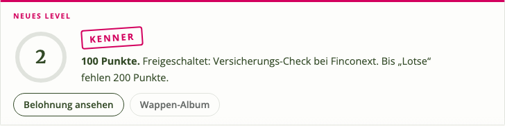  
Wo: ab 100 Punkten (Kassensturz + Quiz) · Code: 05 `levelKarte`, `pruefeLevel`, `LEVEL` · Stempel „Kenner“, Ring bis zum nächsten Level

## E · Mobil

**70 · Landing mobil**  
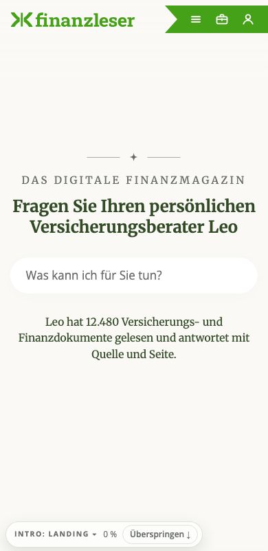  
Wo: 390 px · Code: –

**71 · Burger-Menü mobil**  
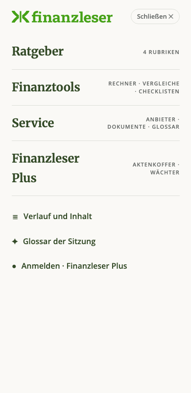  
Wo: Burger im Lesezeichen · Code: 03-js-core `menueAuf`, CSS `.menue`

**72 · Ratgeber mobil**  
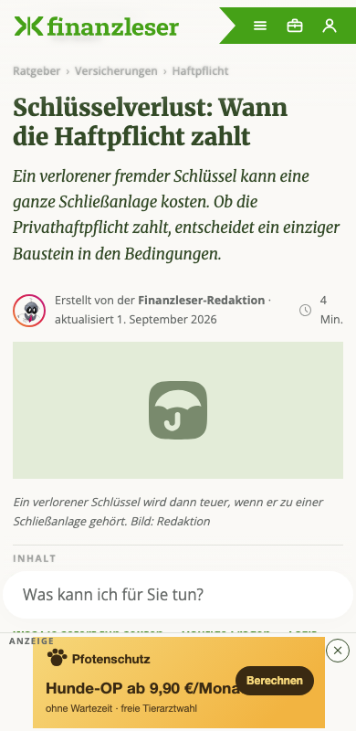  
Wo: 390 px · Code: CSS ≤ 900 px · Anzeigen als 320 × 100

**73 · Schublade Glossar mobil**  
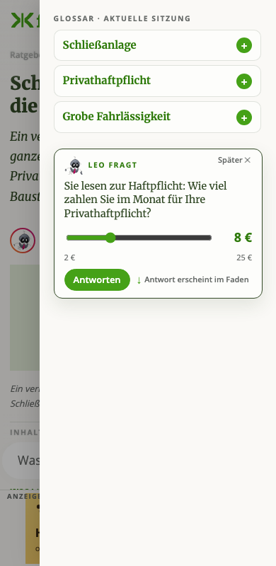  
Wo: Knopf „Glossar“ über dem Faden · Code: 03-js-core `randAuf`

**102 · Anchor-Anzeige mobil**  
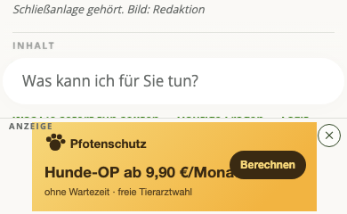  
Wo: `?anchor=1`, nach 400 px · Code: 05 Anchor-Block, CSS `.anchor` · weicht der Eingabe, schließbar

## Was noch fehlt

- **Inhalte statt Elementtypen.** Jeder Kartentyp hat jetzt ein Beispiel. Was fehlt, sind weitere Inhalte: nur ein Ratgeber ist eine Kette, es rechnen zwei Rechner (Unterhalt, BU), es gibt einen Tabellenvergleich, eine Vorlage, eine Anbieter-Karte. Alles Weitere endet in der Platzhalter-Antwort.
- **Lotse (Idee 5).** Bewusst nicht gebaut.
- **Echte Übergänge.** Übergabe an Finconext, WhatsApp, PDF und Word enden im Prototyp als Vorschau oder Hinweis; die Anbindungen (Finconext-Rechner, WhatsApp Business API, PDF-Erzeugung) sind Phase-2-Arbeit.
- **Sharesheet und Druckansicht.** Der Teilen-Dialog zeigt die Wege; Systemdialog und Druck-Layout der Kette fehlen.
